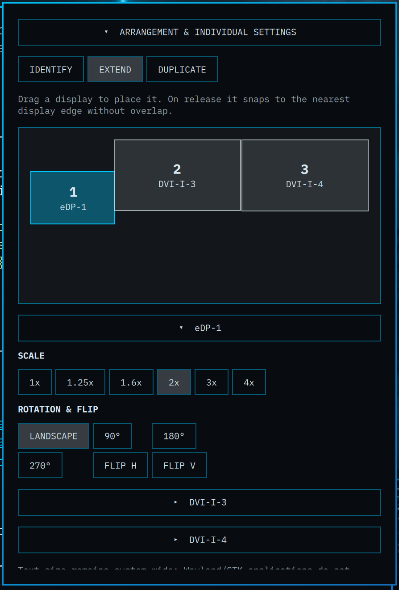

# Omarchy Display Profiles

An interactive Omarchy Display panel for arranging screens, changing per-display scale and rotation, identifying outputs, mirroring the main display, and remembering layouts for every monitor setup.

Profiles are matched by the monitors' EDID identity (manufacturer, model, and serial), not a temporary connector name such as `DVI-I-1`. This makes USB docks and different desks practical: reconnect a known set of monitors and its layout, scale, and rotation are restored automatically.



## Features

- Drag-to-arrange monitor canvas that always fits the full virtual layout
- Per-display scale, rotation, and horizontal/vertical flip
- Identify overlays and main-display mirroring
- Automatic profiles for monitor sets, including USB DisplayLink docks
- Overlapping virtual outputs are allowed; Hyprland may still show its own warning

## Install

```bash
omarchy plugin add https://github.com/ksavona/omarchy-display-profiles.git --enable --yes
cd ~/.config/omarchy/plugins/ksavona.display-profiles
./install
```

Disable the stock Display widget if you do not want both widgets in the bar:

```bash
omarchy plugin disable omarchy.monitor
```

## DisplayLink docks

DisplayLink docks need the proprietary DisplayLink manager and EVDI kernel module. On Arch/Omarchy, install a compatible `displaylink` and `evdi-dkms` package pair, then reconnect the dock. This plugin restores the profile after its outputs appear.

## Notes

- Profiles are stored locally at `~/.config/omarchy/display-layout-profiles.json` and are never included in this repository.
- The helper updates only the managed block in `~/.config/hypr/monitors.lua`.
- This is a community plugin and is not affiliated with the Omarchy project. Omarchy is MIT-licensed; this project is MIT-licensed too.
- The panel and model began as a modification of Omarchy's built-in monitor widget and remain available under the MIT license.
